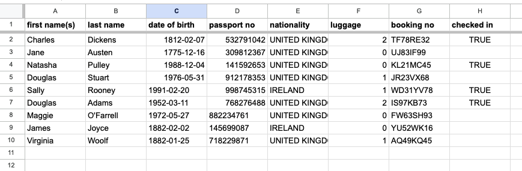

# Magnolia Airport Passenger Management Portal

This program provides a simple command-line interface portal for a small regional airport somewhere in the southern United States. Flight details and booked passenger data is stored in a Google Sheets spreadsheet and the portal provides programs to view information, make bookings, change details and check in.

View the deployed program here - [deployed project link](https://magnolia-airport-378c1ec95a94.herokuapp.com/)

## Project Goals

This project is intended to be a frictionless airport terminal for a small airport. Major passenger management functions, namely booking tichets, updating passenger details, checking in and adding baggage are available, as well as information programs that allow users to get an overview of the current situation, specicially information about all flights and passenger lists for each flight.

The main program allows access to all of these sub programs, which are also cross linked to each other and allow exit back to the main program at various points, in order to provide a smooth user experience without the need to restart the application in order to access each function.

In addition, navigational user responses and data entry is validated throught, to ensure both that all data entered is of the approriate types, and that mistakes and when making program flow decisions can be handled without crashing or needing to restart the program. Error and confirmation messages support this by showing when mistakes were made and when information has been processed correctly.

The program overall should be readable, clearly indicate where user input is needed and explain what needs to be changed after wrong data entry, allow easy navigation and use of passenger management functions, and most importantly allow passenger data to be correctly accessed and manipulated.

## User Experience

The program is designed to be used by airport staff, for example at the check-in counter. Therefore it is not intended to be end user friendly and cuts down on explanations of questions and aesthetic additions in favor of serving a user who sees the same program every day.

However, the program should be intuitive and easy to use, and allow frictionless data entry and navigation between different programs.

### Moving through the portal

The portal opens with a menu of options, which the user can select to start different programs (book a ticket, check in, etc.).

Each program will ask one or more questions of the user, print data to the terminal, and provide options to complete certain tasks or return to the main program.

## Project design and planning

The program is essentially composed of a central main program with a menu of options, and six major sub programs that handle various passenger management tasks. Each of these access other smaller functions throughout the program and link to each other or back to the main menu.

The flowchart below illustrates the core structure and major processing and decision steps in the program (created using [draw.io](https://app.diagrams.net/)).

## Features

The program is designed to be run on a terminal of width 80 by height 24 rows.

### All programs - user input

At input requests throughout the program, the user is given options to exit and return to the main program, or move to another program, where appropriate.

Throughout the program, a line of arrows is printed before prompts for user input as a visual signal to differentiate questions from printed lines of information. The same symbol is used throughout for consistency.

For every question, the program checks if the input given is of a type that was expected. Questions will repeat until a valid option or input type is provided.

### Start up banner

On program start up, the terminal displays a welcome banner and prompts the user to press enter to open the portal.

### Main program

When the main program runs, a welcome message is printed onto the screen. Then a menu of program options is displayed and the user is prompted to select one.

### View all flights

A table of all of the available flights is printed to the terminal, with relevant details for a person looking to book a flight.

The user is then asked if they want to book a ticket.
- 'yes' brings them to the ticket booking program
- 'no' returns them to the main page

### View all passengers for a flight

The user is asked to input a flight number, then details are printed for each passenger on the selected flight.

### Book ticket

A list of available destinations is printed to the screen and the user is prompted to choose one. If they respond with a location not on the list, the list and prompt will appear again.

Flight info for all available flights to the chosen destination are printed to the terminal.
- If there is only one, the user will be asked if they want to book it
- If there are multiple, the details for each will be printed. The user will first be asked if any of the flights are acceptable, then if they answer 'yes', are prompted to select one

If the user says no available flights to the destination are acceptable, they will be given the option to choose another destination or return to the main program.

If a flight is selected, the program will continue with the booking and move to the passenger details page.

A message is displayed on top to confirm which flight is being booked.

The user is prompted with a series of questions to gather relevant information about the passenger. Each question validates the input depending on the expected type of data:
- First/last names - required to have at least one letter and consist of letters, spaces and dashes ('-') only
- Date of birth - required to be a date, passed in the format YYYY-MM-DD, and must be a date in the past (before today)
- Passport no - must consist of letters and numbers only
- Nationality - must be a country in a country list taken from [pycountry](https://pypi.org/project/pycountry/)
- Luggage - must be a whole number between 0 and 2

If an invalid entry is provided, the terminal will display an error message in red explaining what the problem is, then ask the question again.

After all data is entered correctly, the program randomly generates a booking number consisting of two letters, two numbers, two letters an two numbers (e.g. TF78RE32). This number is checked against a list of existing booking numbers, and if not already in the list is added itself, to ensure that booking numbers are not duplicated.

All of the passenger data and the booking number is added to a new row in the worksheet for the relevant flight in the Google Sheets spreadsheet.

The program then displays a message confirming that the booking was completed and prints the booking details to the terminal.

The user can then press enter to return to the main program.

### View and update passenger details

User is prompted to input the last name and booking number associated with a booking.

If the last name does not match the booking, or the booking number does not exist, the user is given options to either try again or return to the main page.

If a booking is found with the matched name and booking number, the passenger details are printed to the terminal. A message will then inform the user whether the passenger is already checked in.

If the passenger is already checked in, the user will be informed that the passenger details can no longer be changed. They will then be given the option to add luggage to the booking (which can still be done after check in.) If they respond 'yes', they are taken to the luggage adding program, if 'no' back to the main program.

If the passenger is not yet checked in, the user will be asked if they want to update any details. If 'yes', they are taken to the update details page.

The program will prompt the user to enter the detail type to be changed. If they enter an invald detail type, a list will appear showing the options and the prompt is repeated.

When a valid option is entered, the user will be asked to input the new data. This will then be validated in the same way as when a ticket is booked. If the data is valid, the information will be updated in the relevant flight worksheet.

In the terminal, a confirmation message will appear stating that the change has been made, and the old and new details will also be printed.

Then the user will hit enter to return to the main program.

### Check in

The user is prompted to enter a last name and booking number, which will be checked in the same way as described above in the ticket booking program.

Once a booking is successfully found, the program will inform the user whether that passenger is already checked in.

If the passenger is not yet checked in, the program will print a message warning that passenger details can no longer be changed after check in. The current passenger details will then be printed and the user will be asked if anything needs to be updated.

If details need to be changed, the user will be taken to the update details program, described above. After updating any necessary data, they will be returned and ask if they wish to continue checking in.

If no details need to be changed, the passenger will be checked in. This will update the 'checked in' cell in their worksheet row to TRUE, and a message confirming the check in will be printed.

### Add luggage

If a passenger is checked in, luggage can only be added, not removed, so this program allows the luggage data to be changed only by increasing the current value.

As above, the booking needs to be retrieved by last name and booking number.

The program then informs the user how much luggage is currently booked, and depending on the number, asks if the user wants to increase that amount or leave it the same.

If a new number is entered, this data is updated in the relevant worksheet, and in any case a message is displayed stating that the change has been made or that the luggage amount has been left at the original number.

### Exit portal

From the main menu, the user can exit the program by entering '100'. A goodbye message is displayed, then the program closed on the same banner as used upon opening.

## Technologies Used

- [Git](https://gist.github.com/derhuerst/1b15ff4652a867391f03) for version control
- [GitHub](https://github.com/) to store project code
- [GitPod](https://www.gitpod.io/) for coding the project
- [PIP](https://pip.pypa.io/en/stable/installation/) to install tools
- [Heroku](https://heroku.com/) for project deployment

### Imported modules/libraries

- [gspread](https://docs.gspread.org/en/v5.10.0/) for manipulating Google Sheets spreadsheet
- [google auth](https://google-auth.readthedocs.io/en/master/) to access Google Drive and Sheets
- [pycountry](https://pypi.org/project/pycountry/) to get a list of world countries
- [termcolor](https://pypi.org/project/termcolor/) to print to the terminal in color
- [halo](https://github.com/manrajgrover/halo) to add spinning icons during loading
- [tabulate](https://pypi.org/project/tabulate/) to display information in tables

### Programming language

- [Python](https://www.python.org/)

## Google API Setup

Google Drive and Google Sheets APIs were used to link this project with a Sheets spreadsheet, allowing data to be read from the spreadsheet, manipulated and added.

Setting up the API requires you to have a [Google account](https://accounts.google.com/signup). In your account, first create a spreadsheet with all of the worksheets you need for your project.

Creating a project, getting APIS set up and activating the API credentials

- Open [Google Cloud Platform](https://console.cloud.google.com/)
- Create a new project
- Give the project a name and click 'create'
- Click 'select project' to go to the project page
- Select APIs & Services from the menu, then select 'Library'
    - Two APIs from the library will be enabled: [Google Drive API](https://developers.google.com/drive/api/guides/about-sdk) and [Google Sheets API](https://developers.google.com/sheets/api/guides/concepts)
- Search for the 'Google Drive API' and select it, then click 'enable'
- On API overview page, click 'Create Credentials'
- You will be asked to fill out a form to get the credentials:
    - From the 'Which API are you using?' dropdown menu, choose 'Google Drive API'
    - Under 'what data will you be accessing?', select 'Application data'
    - For the question on whether you are planning to use the API with Compute Engine, Kubernetes, etc. - select 'No, I'm not using them'
    - Click 'Next'
    - Enter a service account name, then click 'Create'
    - In the 'role' dropdown menu, choose 'Basic' then 'Editor', then press 'Continue'
    - Then click 'Done' (the final options can be left blank)
- Under Service Accounts, click on the address of the service account that has been created
- Click on the Keys tab
- Click 'Add Key' and then 'Create New Key'
- Chooce the JSON key type, then click 'Create'
- A credentials file will be downloaded to your computer - remember where it is located or move it to a folder of your choosing so you can find it later
- Go back to the APIs library, search for and select 'Google Sheets API', then click 'Enable'

Setting up the development environment and project to use the APIs

- Add the file with the API credentials, created in the steps above, to your project workspace (can name the file creds.json)
- Add the file name to .gitignore so the project credentials are not pushed to GitHub (check it is not being tracked by seeing if it appears in the list of files staged for commit if you run the command 'git add .')
- Copy the value of the 'client_email' key
- Open the project spreadsheet, click 'Share', and paste in the client_email
- Make sure 'editor' is selected and untick 'Notify people', then click 'Share'
- In the development environment, two dependencies need to be installed to use the APIs:
    - In the terminal, run the command: pip3 install gspread google-auth
- Import the packages into the python (run.py) file - at the type of the file, add the following two lines:
    - import gspread
    - from google.oauth2.service_account import Credentials
- Set the scope (see code in run.py)
- Add the four lines of code defining constant variables in run.py under the SCOPE variable - these allow you to access the spreadsheet, which is now stored in the SHEET variable

## Bugs

### Booking different flight loop

Bug found 25.7.23

In the book_ticket function, the program asks if a certain flight time is ok, and if the user says "no", they are asked if they want to book another flight. If the user says "no" again, the book_ticket function ends and the main program body continues. On the other hand, if the user first says "yes", they want to book another ticket, the function is called again from the start. 

The function works if the user says "no" to both questions the first time. But here is the bug: if they first say "yes", they want to book another ticket, then say "no", that time doesn't work, and then "no", they don't want to book another ticket, the function doesn't end, and instead asks again if the user would like to book a different flight.

Bug fixed 26.7.23

Fixed the bug by adding a return statement in an if statement in an inner loop in the function. Right above this return statement, the entire function that was currently runnng was called again, which was intended to reset the current program but I believe instead created a second instance of that function running, and when that ended the first function instance kept runnng. Seems to be resolved by adding the return statement to stop the "first" function running after the second ends, but there is probably a more elegant solution.

### Name input validation

The first and las names validation test was changed to required that the user input at least one letter.

### From add luggage function, exit find booking

The find_booking function is set up to allow the user to try entering details again, or exit and return to the main menu if the booking cannot be found. It does this by returning the values None or 'main' to where the function was called. Two of the functions that called find_booking were set up to check for these returned values and so handled them correctly, but the add_luggage function, which also calls find_booking, did not have these checks set up and so if the user attempted to try again or exit to the main program the program threw an error. The issue was fixed by adding checks for None and 'main' return values after the function call in add_luggage.

### Exit and information options

For some programs, it was realized that if the user did not have the neccesary information or did not wish to continue with the program, they would get stuck as there was no way to return to the main menu or retrieve necessary information. This issue was fixed for the following programs.

View all passengers for a flight

- Code was added to give the user the option to either return to the main program or view all flights. This way, the user does not get stuck in the program if no flight number is known.

Book ticket

- Code was added to allow the user to return to the main menu if they don't want to book any of the available flights.

### Uncaught IndexError in book ticket

When multiple flights to a destination were found and the user was asked to enter the number of the flight to be booked, a ValueError exception was handled (e.g. user enters a word instead of a number), but if the user entered a number other than the ones presented, the program threw an uncaught IndexError (for a value outside the list range). The bug was fixed by adding another exception handling for the IndexError.

### Unfixed Bugs

No unfixed bugs were found in the project.

## Testing

Extensive use testing was carried out to ensure that 
- all functions work correctly
- functions link to each other and back home when appropriate
- data is validated correctly
- data is added and changed correctly in spreadsheet

Each function was run through several times, inputting different data types and responses to each question, and the worksheet was checked to ensure data is added properly. Each function was checked by accessing it from the main menu and also from other functions, where possible, to ensure the cross-linking works correctly.

No bugs or uncaught errors were found in this process.

### Validator testing

The code was passed through the [Code Institute PEP8 Python Linter](https://pep8ci.herokuapp.com/#) with no errors.

## Deployment

This project is deployed to [Heroku](https://heroku.com/).

--> Two steps necessary for deployment were completed before moving to Heroku: adding newline characters to inputs, and storing the project dependencies information.

### Input on new lines

In the deployment environment on Heroku, input prompts require new lines after the prompt text in order for the prompt text to show. Therefore, newlines were added after each input request in the project.

### Adding project dependencies information

This step needs to be completed before deployment in order for the project to work correctly in the Heroku app.

Store a list of all the installed dependencies by running the command: 

pip3 freeze > requirements.txt

This adds all of the project dependencies to the requirements.txt file, which can be read by Heroku to install the libraries and modules.

--> After completing the two above steps, the project was deployed to Heroku.

### Heroku account

You need to create a [Heroku](https://heroku.com/) account in order to run apps on it.

This project was deployed on a Heroku account that belongs to a student, and the usage of the platform was paid for by applying for the Heroku Student Pack.

If you have access to the GitHub Student Developer Pack, to do the same, select the role 'Student' when signing up for an account. Then, make sure your [GitHub Student Developer Pack](https://education.github.com/pack) is active (click on the link for info about the pack). To apply for Heroku credits as a benefit of the pack, go to the 'Heroku fo GitHub Students' page ([link](https://www.heroku.com/github-students)) and complete the application for the offer.

### Deploying the project on Heroku

Steps to deploy the project to Heroku

- Go to your Heroku dashboard
- Create a new app by clicking 'Create new app' or selecting this from the 'New' dropdown menu in the top right
- Give the app a name, select a region, then click 'Create app'
- On the app page, select the 'Settings' tab
- In the Config Vars section, click 'Reveal Config Vars' to set up your config vars
    - This project has credentials, which were added to the app as follows. Add the creds.json information from the project by first typing CREDS in the config var 'key' box. Then, open the project workspace, copy all of the contents of the creds.json file, and paste this into the 'value' box. Click 'Add' to add this config var
    - Underneath, create another config var with key PORT and value 8000
- Add two buildpacks to the app: python and nodejs (ensure these are in this order - the python buildpack should appear above nodejs in the list when both are added)
- Select the 'Deploy' tab
- This project used the GitHub deployment method:
    - Select 'GitHub' under Deployment method
    - Click 'Connect to GitHub'. You may be need to sign in to GitHub to allow access
    - In the Connect to GitHub section, search for the project repository name, then click the 'Connect' button next to the repository
    - Deploy the project automatically or manually by clicking the appropriate button
- Once Heroku confirms that the app deployment has been successful, click 'View' to view the deployed project

### Activating eco dynos

Dynos need to be activated in your account in order to run apps on Heroku. (Eco dynos are dynos that "go to sleep" automatically after a period of inactivity.) This only needs to be done for the entire account; you don't need to repeat this process for every new project.

Steps to activate eco dynos

- Go to your Heroku dashboard
- Navigate to 'Account settings' by clicking on your avatar icon
- Go to the 'Billing' tab
- Click 'Subscribe to Eco' in the Eco Dynos Plan section
- Click the 'Subscribe' button to activate the dyno hours

## Attributions

### Magnolia start-up banner

Magnolia outline in start-up banner was created by taking an image from Freepik (link below) and uploading it to ASCIIart.club.

Image by <a href="https://www.freepik.com/free-vector/hand-drawn-simple-flower-outline-illustration_24999034.htm#query=magnolia%20outline%20simple&position=0&from_view=search&track=ais">Freepik</a>

<a href="https://asciiart.club/">ASCIIart.club</a>

### Slow print function

Slow print function taken from this <a href="https://stackoverflow.com/questions/4099422/printing-slowly-simulate-typing">stackoverflow post.</a>

### Other credits

- The flowchart in this README document was created using [draw.io](https://app.diagrams.net/)
- Code Institute for the deployment terminal